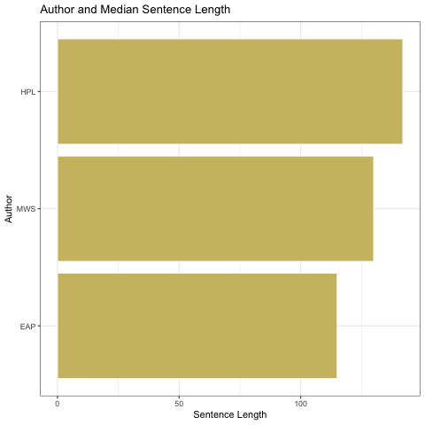
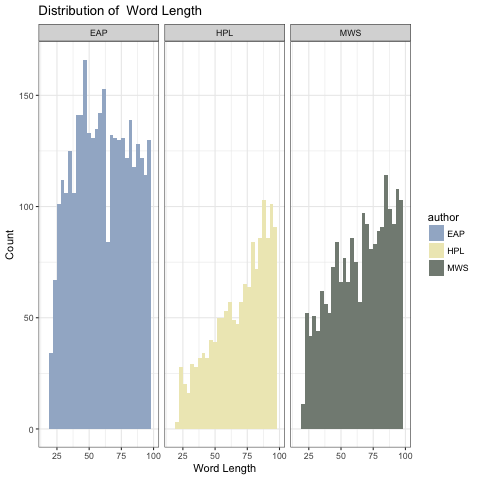
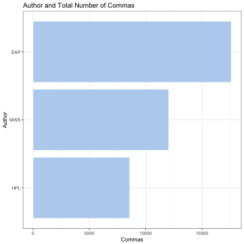
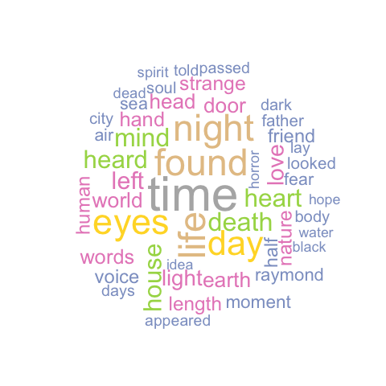
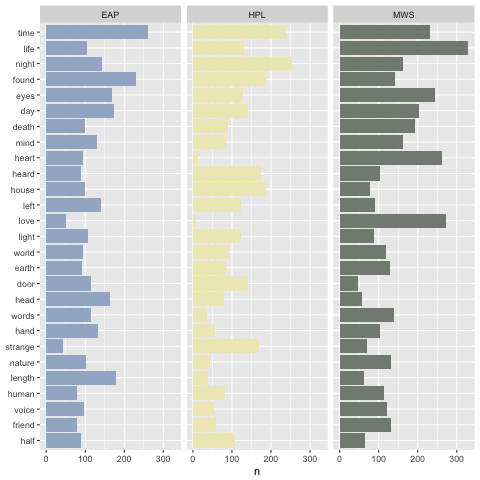
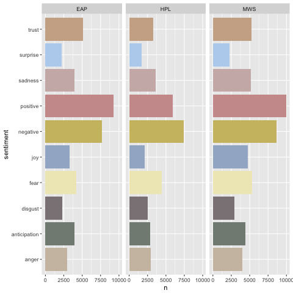
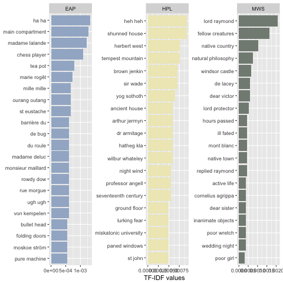

# Spring2018
# Project 1: Do horror fiction authors use more SPOOKY words?

----
This is an edit.

### [Project Description](doc/)
This is the first and only *individual* (as opposed to *team*) this semester. 

Term: Spring 2018

+ Project title: The Importance of Punctuation and Negation in Author Identification
+ This project is conducted by Nicole Smith (uni: nas2184)
+ Project summary: Using text mining,  I analyze the corpus of three authors: HP Lovecraft (HPL), Edgar Allen Poe (EAP), and Mary Shelley (MWS) in an attempt to understand potential identification tools. From my analysis, I argue that negation, punctuation, and some sentiment analysis are the most appropriate methods for classifying the style of each author. EAP most often uses commas and shorter sentences (as well as French words), MWS is more likely to use positive words (love, life, heart) or character names, and HPL uses longer sentences lacking in punctuation and more negative tones.

### What are some styles of horror fiction authors?
Just as individual personalities differ from person to person, authors' writing styles differ among a variety of character traits, some of which I will try to analyze in the following project. Some of these character traits include: sentence or word length, use of punctuation (commas, semicolons, colons, etc.), negation of words, use of foreign words, emphasizing certain emotions, and use of character names over pronouns.

Let's begin with some simple analysis looking at the count of sentence and word length.



By looking at the median sentence length, we see that HP Lovecraft, tends to have longer sentences than the author two authors. Edgar Allen Poe has a median sentence that is about 20-30 characters shorter than Lovecraft. Mary Shelley is in between the two authors in terms of median length. If we were to build a simple predictive model based on sentence length, we might be able to capture some of EAP's sentences, but this is not enough to accurately predict the authors of sentences.



From the above figure, we see that Lovecraft and Shelley tend to have sentences with word length between 75 and 100, whereas Poe has sentences that have a wide range of word lengths with a dip around 65. Although we are closer to building a predictive model, there is still much variability in word length between and among authors. Maybe some contextual analysis will help us to understand how to categorize each other.

### Who elicits pausing among readers?
Commas, semicolons, and colons signal to the reader that she should pause in her understanding and potentially absorb the clause before. This "pausing" may create anticipation among readers, and one might predict that horror fiction authors are attempting to elicit feelings of anticipation and fear among their readers.



EAP uses the most commas among the three authors, nearly double how many HPL uses. This is interesting because we know from above that HPL tends to have longer sentences (median length around 75-100 characters in each sentence), but he does not appear to use commas to separate out clauses. EAP on the other hand has more variability in his sentence lengths and appears to be comma heavy. Since commas and other forms of punctuations are “pauses” for the reader, maybe EAP uses these tools to slow down the reader and build suspense in his horror fiction.

### What do the authors have to say?


Do any of these words scare you? Some individuals may be frightened by the most common word, "time," depending on the context in which it is used. As mortals, we are all running out of time until death takes us, and the authors may be alluding to this fact. More explicitly, we may be frightened by other common words, like "death," "soul," "passed," "black," "horror," "door," and "eyes" depending on the context of each word. The words do not appear atypical to what one would speculate as the most common words in horror fiction, but let's take a look at how authors favor and use these words.



From the wordclouds, we know that some authors favor certain words over other, but it is also important to understand if these words are outliers in the entire corpus. From the above figure, we see that Mary Shelley does use “life,” “love,” and “heart” more often than the other two authors (which confirms our assumptions above). We can also see that HPL also never uses “heart” or “love,” and rather prefers words like “night” and “time.” MWS also tends to use “death” more than the other two authors. It is not clear if this is because she refers to death more often or if the HPL and EAP use different words and statements to refer to death. In continuing to build a predictive model for author identification, one might consider including the most popular words of each author.

### What are we missing?
Because authors have different personalities and styles, we look at the use of negation to convey meaning in their horror fiction stories.


When looking at the negated words for Shelley, it is interesting that “die” or rather “not die” is the most frequently used word, when her previous wordcloud shows “life” as important for her literary style. It is also interesting that “not love” appears with a similar frequency as above. Although Shelley appears to be more positive than the other two authors in the word frequency comparison above, it is possible from this textual analysis that she is negating these positive words, such as “love,” “hope,” and “feel.” Another step in predicting author identification could be to distinguish between the use of "die" and "not die" among each author, as these are used in varying degrees and convey different meanings.

### How does it make you feel?


In the entire corpus, we see that there are slightly more positive than negative words used. The NRC lexicon looks the following words: anger, anticipation, disgust, fear, joy, sadness, surprise and trust. From the horror fiction literature we have, we see that emotions of fear, trust, sadness, and anticipation are the most common sentiments.

When looking at the sentiments of each author, we can somewhat confirm our initial conjecture that MWS is more positive than the other two authors. ALthough EAP is more positive than negative and only slightly less positive than MWS, HPL is much more negative than he is positive. HPL has fewer words that are classified as “anticipation,” which is interesting since he also does not use punctuation to build anticipation among his readers. However, the lexicon is crowd-sourced, and it is possible that HPL uses words that we not categorized in this particular lexicon.


The lexicons appear to classify the authors in similar manners (at least directionally). All three illustrate that HPL is the most negative of the three authors, and MWS and EAP are somewhere in between negative and positive. It is important to note the difference in scales. While AFINN and Bing range from -4000 to 0, NRC ranges from -1000 to 1000.

### What are the most common bigrams?
Although we investigated word frequency, there is something to be said about phrase frequency as the combination of two words is almost infinite.



The phrases most used by EAP and HPL are “ha ha” and “heh heh” respectively, and maybe the authors are making jokes or laughing at the reader. Although HPL was categorized as more negative, he uses laughter (possibly in a rude way) often. EAP, again, uses more French phrases in his corpus than the other two authors. With MWS, we again see that she uses names of characters and places as well as “poor wretch/girl” frequently.

### Concluding Remarks
In this text analysis, investigating punctuation and character names, as well as triggered reader emotions, appears to be the most promising source of author identification. We can easily classify EAP with shorter sentences and French words, whereas HPL can be categorized by more nature-themed phrases, and MWS by her use of love and positive phrases. Although we assumed that horror fiction would use more spooky words, the word frequency does not explicity show that. It is likely that the construct of sentences and descriptions are what yield to the spooky nature of horror fiction. Building a predictive model should include the distinctions between each author in terms of variation of punctuation and frequency of words, and these provided the most information on difference in writing styles in the above analysis.

### Citations
Some of the above work was adapted from the following posts:
<https://www.kaggle.com/headsortails/treemap-house-of-horror-spooky-eda-lda-features.>
<https://www.kaggle.com/ambarish/tutorial-detailed-spooky-fun-eda-and-modelling>
<https://www.tidytextmining.com/ngrams.html>

```
proj/
├── lib/
├── data/
├── doc/
├── figs/
└── output/
```

Please see each subfolder for a README file.
